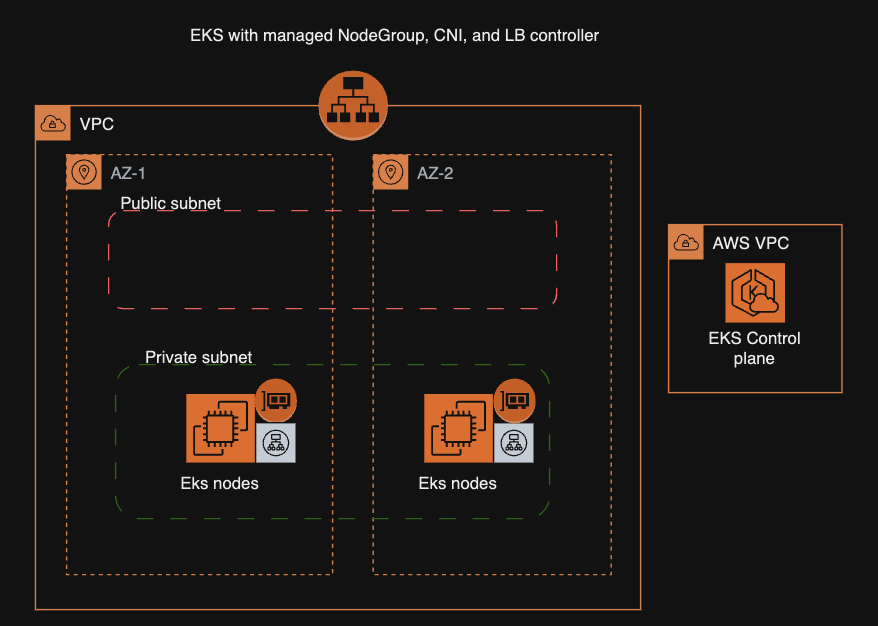

<a href="https://vettom.github.io/"></a>


# :desktop_computer: Complete EKS cluster [Terraform]

> :warning: Recomend using LB controller with Ingress controller than use ALB. Check [EKS-Cluster-ingress](https://github.com/vettom/aws-eks-terraform/tree/main/EKS-Cluster-ingress)

 Terraform code to provision complete EKS cluster.  

- VPC with 2  privat and 2 public zones
- EKS cluster with Managed NodeGroup (1 Node)
- VPC CNI add-on with prefix delegation
- AWS Loadbalancer controller




> :information_source: AWS profile called `labs` used for terraform authentication

## Creating cluster
```bash
terraform init
terraform plan
terraform apply
```

## Configure kubeconfig
```bash
aws eks --profile labs --region eu-west-1 update-kubeconfig --name eks-demo
kubectl cluster-info
k9s
```
## Limitations of using ALB for ingress
|Limitation|Comments|
|------------------------|----------------------------------|
|Registration/deregistration| ALB is slow to register/deregister targets, can lead to down time during release unless workarounds used |
|Metrics| ALB Metrics are in Cloudwatch, have to export separately to use with tools of your choice like Prometheus |
|Cannot use ClusterIP| ALB TG send traffic direct to pod, so cannot support ClusterIP. |


|Resource|Components|
|--------------------------|--------------------------|
|VPC| 2 public and 2 private subnets and Single NAT GW|
|EKS Cluster|Node group with single SPOT instance, VPC CNI Plugin,AWS Loablanacer Controller |
------------------
