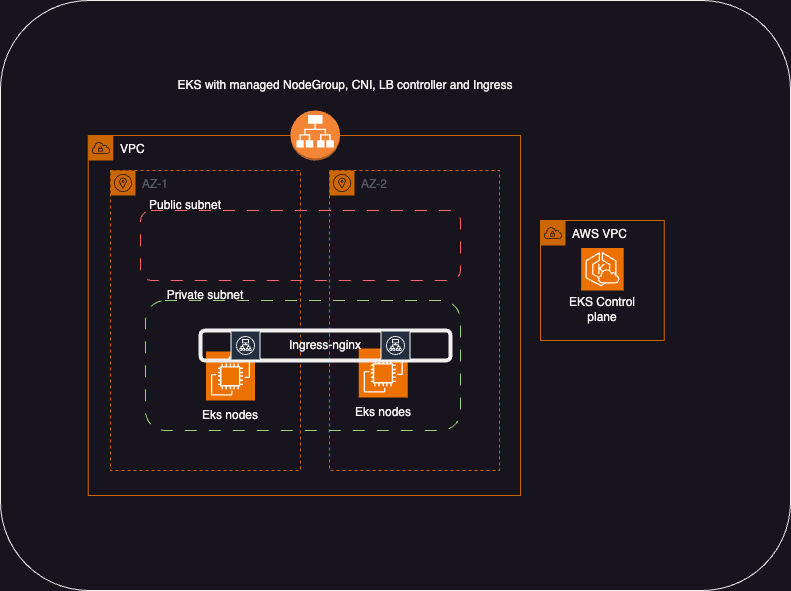

# :desktop_computer: EKS cluster with Ingress-Nginx [Terraform]

 Terraform code to provision complete EKS cluster.  

- [x] VPC with 2  privat and 2 public zones
- [x] EKS cluster with Managed NodeGroup (1 Node)
- [x] VPC CNI add-on with prefix delegation
- [x] LB Controller installed (No ALB)
- [x] Ingress-Nginx controller




> :information_source: AWS profile called `labs` used for terraform authentication

## Creating cluster
```bash
terraform init
terraform plan
terraform apply
```
## Configure kubeconfig
```bash
aws eks --profile labs --region eu-west-1 update-kubeconfig --name eks-demo
kubectl cluster-info
k9s
```
## Insall nginx-ingress

```bash
helm repo add ingress-nginx https://kubernetes.github.io/ingress-nginx 
helm repo update ingress-nginx
# Must be in aws-eks-terraform/EKS-Cluster-ingress folder to execute below
helm install ingress-nginx -n ingress-nginx --create-namespace -f ingress-app/nginx-ingress-values.yaml ingress-nginx/ingress-nginx
kubectl get po,svc -n ingress-nginx
```
## Install Sample app and verify
Follow instructions in [Sample App README.md](https://github.com/vettom/aws-eks-terraform/blob/main/EKS-Cluster-ingress/Sample-App/README.md)
|Resource|Components|
|--------------------------|--------------------------|
|VPC| 2 public and 2 private subnets and Single NAT GW|
|EKS Cluster|Node group with single SPOT instance, VPC CNI Plugin,AWS Loablanacer Controller |
| Ingress NLB| NLB with target type IP for ingress traffic |


